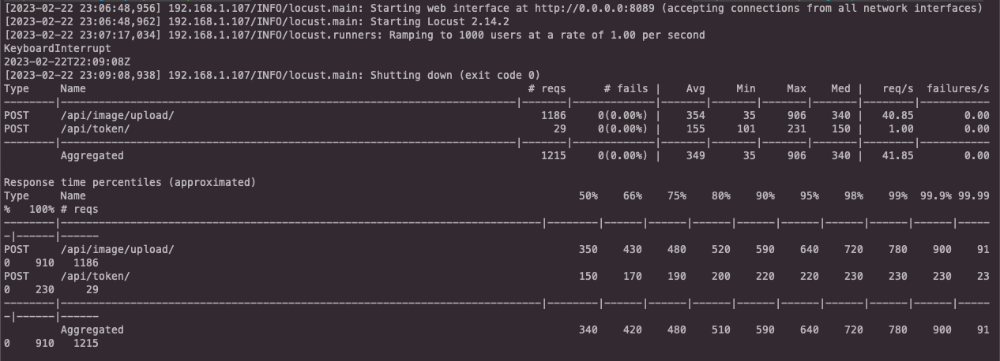

## Image API
Api that allows users for uploading their images, creating
thumbnails from them and fetching temporary image access links.

Stack:
- Django
- Django Rest Framework
- Postgres
- Celery
- Docker
- Redis

### Setup & Configuration
I used docker-compose to provide as simple project setup as possible.
To run this project locally follow following steps:
- Clone this repository and navigat to project root folder
```python
git clone https://github.com/LilJack118/image-api.git && cd image-api
```

- Build docker containers
```python
docker-compose build
```

- Run docker containers (optionaly run multiple celery instances)
	**NOTE** There is no need to create superuser, the default admin with Enterprise tier is created automatically
**	username: admin
	password: admin**
```python
docker-compose up --scale celery_worker=1
```

- To perform loadtests you have to install locust
```python
pip install locust
```
And run `locust` command from project root directory.

### How it works?
- #### Creating Thumbnails
For creating thumbnails i considered mainly two approaches. 
- **Create thumbnails on demand**
When user uploaded original image store it and then when thumbnail is requested scale original image, save it (for future requests) and return it in response. Main adventage of this approach was ability to create thumbnails for images uploaded before upgrading tier (for example when user had Basic tier he had access only to 200px height thumbnail but with Professional it was 200px and 400px). But this approach also has two main disadventages. First one was storing original image even if tier don't allow user to access it, and since most users will probably have Basic tier that will be waste of storage resources. Moreover this solution can easy lead to response timeout (drf is using wsgi as server gateway so waiting for image to scale before sending response can really slow down api when many concurrent users will try to send requests). 
- **Create all required thumbnails when user upload image (approach is used in this project)**
When file is uploaded and validated correctly image (in binary format) is cached in redis (for quicker access in celery worker) then thumbnails are created in celery worker and response is send to client without waiting for task result. Main disadventage of this approach is lack of notifying client if error occures during creation of thumbnails. But this can be fixed by using webhooks (Stripe or AssemblyAI use this approach) to send user notification when task will fail.

- #### Temporary Access Image Link
Temporary access image link is created from two parts
- token (which has encrypted information about expire_time and image path)
- path - path to image file
When user send request firstly token is validated and then (if it is valid) specified image is returned in response. There is worth noting that i don't send any request to database asking for image object to drop connections with database to minimum (in order to keep high performance and quick response time).

### Load Testing & Performance
I created basic load test with locust to test performance while sending many concurrent requests to upload endpoint. This test imitate many concurrent users (with Enterprise plan) trying to upload 1920x1200 (37.68kb) jpeg image and was performed on containerized project with only one celery container.

None of 1186 requests failed (each celery task was also completed successfully). Average response time took 354ms. When it comes to performance in creating thumbnails i used multiprocessing to reduce time needed to perform this operation to minimum (i managed to drop from about 0.4s to 0.25s for single celery task to finish for this load test).